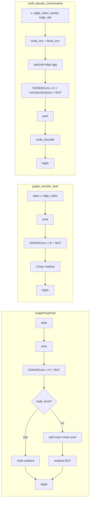

# SONAR implementations: detailed reports and comparison

This document evaluates the three SONAR model implementations in the repository and compares them. The issues described in the "Notable issues" and "Bug summary" sections have been addressed in the codebase.

## Paper and theory

The three implementations follow the discretization of the wave equation described in the SONAR paper (NeurIPS 2025): [*SONAR: Long-Range Graph Propagation Through Information Waves*](https://openreview.net/pdf?id=Hxfjmc95rl). For notation, key equations, and a mapping from paper symbols to code, see the [Paper reference](SONAR_paper_reference.md).

---

## 1. Detailed report: GraphPropPred/models/sonar.py

**Role**: Graph property prediction (e.g. diameter, sssp, eccentricity). Used by `GraphPropPred/conf.py` and `train_GraphProp`; `runtimes.py` imports `SONARConv` from here for layer-scaling benchmarks.

**Architecture**

- **LaplacianAggr** (MessagePassing): Builds resistance-weighted Laplacian via `get_laplacian`; `Linear(in_channels, in_channels, bias=False)`; supports `normalization` in `None`, `"sym"`, `"rw"`. Message: `edge_resistance.view(-1,1) * x_j` (or `x_j` if no weights). `__repr__` uses `self.in_channels` (set in `__init__`).
- **NullForce**: Placeholder returning `zeros_like(input)` for optional dissipation/forcing.
- **SONARConv**: Resistance-weighted Laplacian updates over `num_iters` with optional dissipation and forcing. Edge resistance net: `Linear(edge_channels + in_channels*2, in_channels) -> ReLU -> Linear(in_channels, 1)`; optional `edge_weight` is concatenated to edge features. **Update rule**: `v = v - epsilon*(conv + diss*v - forcing)`; **x = x + epsilon * v** (no activation on `v`). Default `activ_fun='Identity'`; BlockSONAR passes `'Identity'` so activation is effectively unused. Uses `fix_resistance` (typo fixed).
- **BlockSONAR**: Embed (`Linear(input_dim, hidden_dim)`), then `num_blocks` of (SONARConv + MLP with configurable activation, e.g. Tanh), then readout. **Readout**: If `node_level_task`: 2-layer MLP (hidden -> hidden//2 -> output) with LeakyReLU; else concatenate **global_add_pool**, **global_max_pool**, **global_mean_pool** (hidden_dim*3) then 2-layer MLP to output. Forward uses `data.x`, `data.edge_index`, `data.batch`, and optional `data.edge_weight`.

**Data contract**: PyG `data` with `x`, `edge_index`, `batch`; optional `edge_weight`. No `edge_attr`; no encoders.

**Resolved**: LaplacianAggr now sets `self.in_channels`; SONARConv dead `W`/`bias` removed; `fix_restistance` corrected to `fix_resistance`.

---

## 2. Detailed report: graph_transfer_task/models/sonar.py

**Role**: Synthetic long-range transfer (line, ring, crossed-ring). Used by `graph_transfer_task/conf.py` (`get_BlockSONAR_conf`) and `graph_transfer_task/sensitivity.py`.

**Architecture**

- **LaplacianAggr** / **NullForce**: Same pattern as GraphPropPred; `in_channels` set for `__repr__`.
- **SONARConv**: Same building blocks (conv, dissipation, forcing, edge_resistance_net). **Key difference**: **x = x + epsilon * self.activation(v)** (activation applied to velocity before adding to position). Default `activ_fun='tanh'`; BlockSONAR_Model passes `'Identity'`, so in practice activation is disabled. Uses `fix_resistance`.
- **BlockSONAR_Model**: Embed (optional, `Linear` when `hidden_dim` set), same block layout (SONARConv + MLP with activ_fun), **single `Linear(hidden_dim, output_dim)` readout** — no pooling, no batch dimension in readout. **Forward**: `data.x`, `data.edge_index`, and optional `data.edge_weight` (wired from data). **Extra methods**: `forward_multin(x, edge_index)` for raw tensors; `forward_sensitivity(data)` uses `jacrev` on a layer function and returns sensitivity (device from `self.device` or `data.x.device`).

**Data contract**: PyG `data` with `x`, `edge_index`; optional `edge_weight`. No batch in readout; no encoders.

**Resolved**: LaplacianAggr `in_channels` and `__repr__` fixed; SONARConv dead `W`/`bias` removed; `fix_restistance` → `fix_resistance`; `forward_sensitivity` cleaned (no prints, no dead return, device handling); `edge_weight` taken from data when present.

---

## 3. Detailed report: multi_domain_benchmarks/models/sonar.py

**Role**: Multi-domain benchmarks (heterophilic, LRGB, graph classification, etc.). Used by `multi_domain_benchmarks/models/model_configs.py` and experiments; configured via `EnvArgs` and `Pool` in `multi_domain_benchmarks/helpers/classes.py`.

**Architecture**

- **EdgeFeatureAggregator** (MessagePassing): Aggregates `edge_attr` with degree-scaled weights; optional gradient term: message = avg (and optionally grad) combined with edge_attr. Used when `aggregate_edge_features` is True to augment node features.
- **LaplacianAggr**: Same Laplacian idea; **Linear(..., bias=True)**; **accepts `edge_attr`** in forward and message; message returns `edge_resistance * (x_j + edge_attr)` when `edge_attr` is not None (else same as others). `in_channels` set for `__repr__`.
- **NullForce**: Same placeholder.
- **SONARConv**: No `W`/`bias`. **velocity_net**: `Linear(in_channels, in_channels)` so **v = velocity_net(x)** instead of zeros. **edge_resistance_net**: **Linear(in_channels*2, 1) -> ReLU** only (no edge_channels; edge info flows via LaplacianAggr's `edge_attr`). **external_forcing_net**: single `Linear(in_channels, in_channels)` (no ReLU). **dropout**: uses constructor `dropout` parameter. **Update**: `v = v - epsilon*(self.dropout(conv) + diss*v - forcing)`; **x = x + epsilon * v** (no activation on v in the ODE step). `activation` is used in BlockSONAR after the conv block. Uses `fix_resistance`.
- **BlockSONAR**: Constructor takes **env_args: EnvArgs** and **pool: Pool**. Uses dataset encoders: **node_encoder** (with `pestat`), **node_decoder**, **bond_encoder** for edges; optional **EdgeFeatureAggregator** (increases effective hidden dim by 2*hidden_dim when used). Per block: **pre_norms**, **dropouts**, **post_norms** (BatchNorm or Identity), **residual** connection, **pre_act_norm** option. MLP: **Linear -> GELU -> Linear**. Pooling from **pool.get()** (e.g. mean, sum, or GPP-style concat). Forward: **(x, edge_index, pestat, edge_attr=None, batch=None)**; node encode, optional bond encode, optional edge aggregation, `add_remaining_self_loops` for edge_attr, then blocks (conv -> optional pre_act_norm -> activation -> dropout -> residual -> MLP -> post_norm), then pool, then node_decoder.

**Data contract**: Raw tensors + `pestat` and optional `edge_attr`, `batch`. Full encoder/decoder and pool abstraction; supports node- and graph-level via Pool.

**Resolved**: SONARConv uses constructor `dropout`; unused `self.bnorm` removed; duplicate init of node_encoder/node_decoder removed (only `node_decoder` re-set after `aggregate_edge_features` for correct `hid_dim`); LaplacianAggr `in_channels` and `__repr__` fixed; `fix_restistance` → `fix_resistance`.

---

## 4. Comparison of the three implementations

| Aspect               | GraphPropPred                                           | graph_transfer_task                          | multi_domain_benchmarks                                   |
| -------------------- | ------------------------------------------------------- | -------------------------------------------- | --------------------------------------------------------- |
| **Task**             | Graph-level and node-level property prediction          | Long-range transfer (single-graph style)     | Multi-domain (heterophilic, LRGB, etc.)                   |
| **Config**           | Explicit args (input_dim, hidden_dim, num_blocks, etc.) | Same style                                   | EnvArgs + Pool abstraction                                |
| **Input**            | `data` (x, edge_index, batch; optional edge_weight)     | `data` (x, edge_index; optional edge_weight) | (x, edge_index, pestat, edge_attr, batch)                 |
| **Encoders**         | None (linear embed only)                                | None (linear embed only)                     | Node + edge encoders, optional pos enc                    |
| **LaplacianAggr**    | No bias, no edge_attr                                   | Same                                         | bias=True, edge_attr in message                           |
| **SONARConv**        | v=0; x += ε·v; no activation on v                       | v=0; x += ε·activation(v)                    | v=velocity_net(x); x += ε·v; dropout(conv)                 |
| **Edge features**    | Optional edge_weight in resistance net                  | Optional edge_weight from data               | edge_attr in Laplacian + optional EdgeFeatureAggregator   |
| **Block after conv** | MLP (Linear-act-Linear)                                 | Same                                         | Norm/act/dropout/residual + MLP (GELU) + norm             |
| **Readout**          | Node: MLP on hidden; Graph: add+max+mean pool then MLP  | Single Linear (no pool)                      | Pool from Pool enum (mean/sum/GPP/None) then decoder       |
| **Extra**            | —                                                       | forward_multin, forward_sensitivity (jacrev) | EdgeFeatureAggregator, residual, layer_norm, pre_act_norm |

**Shared traits**

- All use resistance-weighted Laplacian propagation with optional dissipation and forcing.
- All use a block structure: (SONARConv + MLP) × num_blocks.
- All use the corrected attribute name `fix_resistance` in SONARConv.
- GraphPropPred and graph_transfer_task do not define unused parameters in SONARConv; multi_domain never did.

**Divergences**

- **Velocity update**: GraphPropPred and multi_domain use **x += ε·v**; graph_transfer uses **x += ε·activation(v)** (and can set activation to Identity).
- **Initial velocity**: GraphPropPred and graph_transfer use **v = 0**; multi_domain uses **v = velocity_net(x)**.
- **Readout**: GraphPropPred supports both node- and graph-level with explicit pooling; graph_transfer is single-graph linear readout; multi_domain uses configurable Pool and decoder.
- **Edge handling**: GraphPropPred and graph_transfer use optional edge_weight; multi_domain uses edge_attr in Laplacian and optional EdgeFeatureAggregator.
- **Richness**: multi_domain is the most feature-rich (encoders, residual, norms, dropout, edge aggregation); GraphPropPred adds graph-level pooling and node_level_task; graph_transfer is minimal and adds sensitivity scaffolding.

---

## 5. Diagram: high-level data flow

